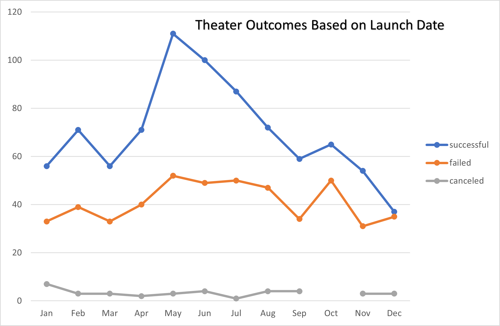
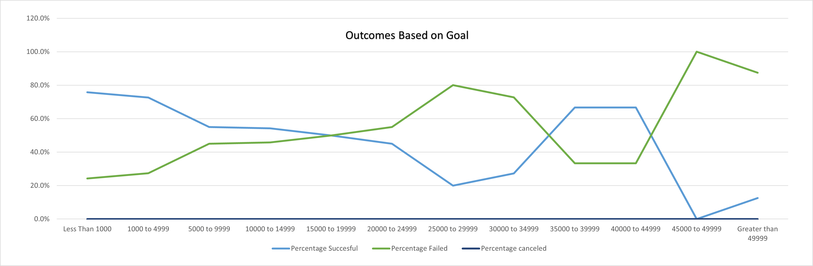

# Kickstarting with Excel

## Overview of Project

This project is an analysis of Kickstarter campaign data for up-and-coming playwright Louise. We use Microsoft Excel for the transformation, sorting, filtering, and analysis of the data. The data spans years from 2009 to 2017, and includes campaign goals, pledge amounts, and the result of the campaign.

### Purpose
	
Louise is looking to crowdfund her latest play *Fever* through Kickstarter. She estimates the play will cost apporximately $12,000 to produce. Because there are so many variables that could affect the success of a crowdfunding campaign she is looking to us to help her create a campaign with the best possible chance of success. We will filter the data to look at the outcomes of similar campaigns and find out what variables affect the success of a campaign the most. After analysis of the data we will be able to advise Louise on what she can do to ensure she has the best possible chance of making sure her play is fully funded. 

## Analysis and Challenges

Before we could start the analysis we needed to make sure the data was in a format that we could easily analyze. The deadline and launch dates were given as UNIX timestamps and needed to be converted to a human readable format by using the formula `=(((<cell>/60)/60)/24) + DATE(1970,1,1)`. This formula converts the UNIX timestamp to hours and adds it to January 1st, 1970 in order to get the readable date.
The column 'Category and Subcategory' was split into two separate 'Parent Category' and 'Subcategory' columns in order to allow more granular filtering of the campaigns. In addition we added a columns for the year the campaign started and the percentage of the funding goal the campaign received. However we did not use those columns in our final analysis. 

### Analysis of Outcomes Based on Launch Date

The first factor in the success of a kickstarter campaigns we were interested in looking at was how well the campaigns did based on their launch dates. For this we created a pivot table using the years and parent category as filters, date created as the rows, and outcomes as the columns. We then filtered the parent category to look only at campaigns that were for 'theater'. To better visualize the data we created a line chart with markers to show how the time of year the campaign was launched correlated with the campaign outcome. 
>
>Figure 1. In this chart we see that the number of successful campaigns drops as the year goes on, while the number of failed campaigns remains relatively consistent. 

### Analysis of Outcomes Based on Goals

We know that Louise estimates the cost of producing her play will come to about $12,000 so we needed to take a look at how her campaign goal will affect her chances of success. Using Excel's `=COUNTIFS()` function we filtered the data to only look at plays, and then into groups based on their goals and outcomes, grouped in increments of $5,000. From there we calculated the percentage in each group that was successful and the percentage that failed. We again created a line chart to better visualize any trends in this data. Up to goals of about $30,000 the increasing goal amount is positively correlated with failure and negatively correlated with success. Higher amounts then that do not seem to have any trend however. 
>
>Figure 2. In this chart we see that up to a certain amount a larger goal is more likely to result in failure.

### Challenges and Difficulties Encountered

Some of the challenges we encountered were working with the filters on the main dataset in Excel. Having to make sure that everything was unfiltered before doing any action was a bit inconvenient, and led to a few instances where unforseen problems popped up. In addition it wasn't always clear what data was being pulled into each worksheet because of the way the filters in Excel work. 

## Results

<!-- - What are two conclusions you can draw about the Outcomes based on Launch Date? -->
It is pretty clear from the chart visualizing outcomes based on launch date that campaigns starting in May have the best chances of meeting their goals. Also, while the number of campaigns that succeeds has a very definite peak in May, the number of campaigns that fail is fairly consistent throughout the year. From what we can see in the data it would be best for Louise to start her campaign in late spring or early summer to giver her play the best chance of being fully funded. 

<!--- What can you conclude about the Outcomes based on Goals? -->
For the most part when we look at outcomes based on goals we see what is expected, as the goal amount increases the chances of a campaign succeeding decreases. However as can be seen in figure 2 once the goal amount is greater than $30,000 the relationship appears to fall apart. This could possibly be due to a smaller number of campaigns being started with those higher goals, but as the graph shows percentage of total it isn't possible to say from the graph alone. 

<!--- What are some limitations of this dataset? -->
Since Kickstarter hasn't been around for more than a couple decades the records of campaigns available doesn't span a very large amount of time. Additionally, before 2014 in our dataset there is only a handful of campaigns available to look at the data for. The latest year for the data set is only 2017, so we are really only looking at a four or five year time period of data. Another limitation of the dataset is that while it includes the country of the kickstarter campaign, the United States is large enough that it would be helpful if there was a sub-dimension for the state the campaign is based in. While for some categories of campaign this won't make a difference, for something like theater there could be different outcomes depending on where the play starts. 

<!--- What are some other possible tables and/or graphs that we could create? -->
Some other pieces of the data we could take a look at would be to look at the relationship between outcome and staff picks and spotlights. It's possible that increasing the awareness of a campaign through those means could have a large effect on the outcome of the campaign. A graph relating average donation to outcome would also be beneficial to have to compare to the graph for pledge goal to outcome in order to see whether donation amount has any correlation with outcome. Additionally since kickstarter pledges are usually suggested in discrete amounts, often with differing rewards based on the size of the pledge, it could help Louise to determine how she should structure her campaign.
